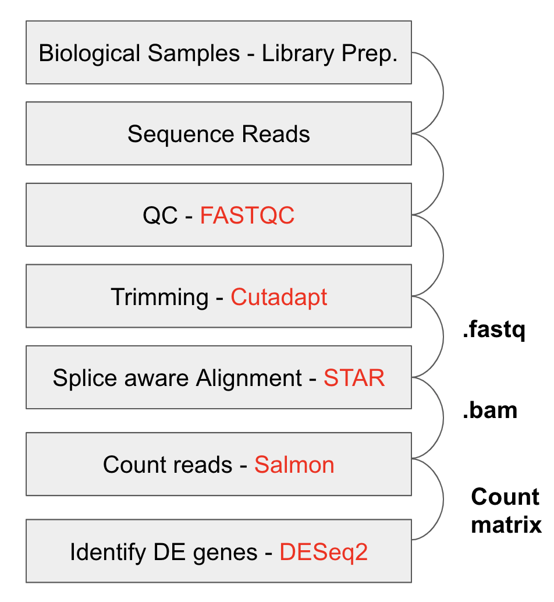
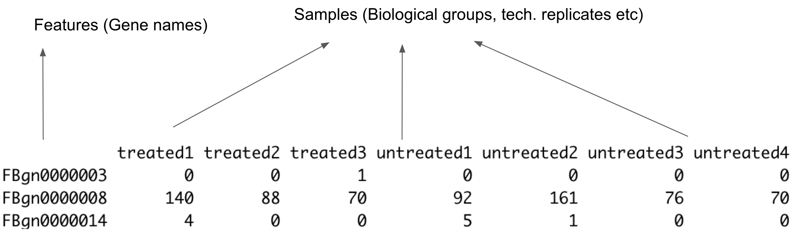
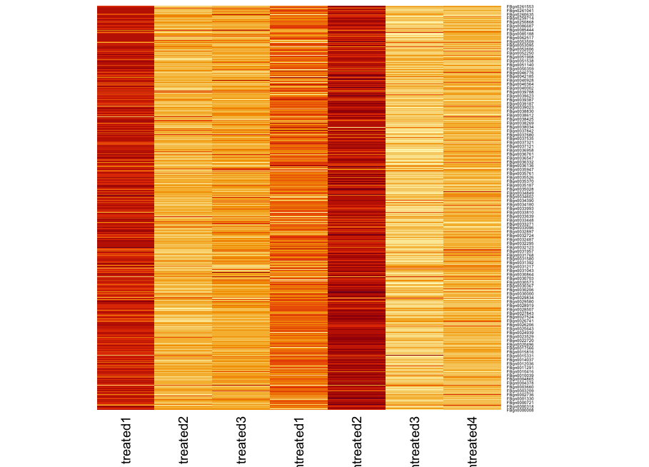
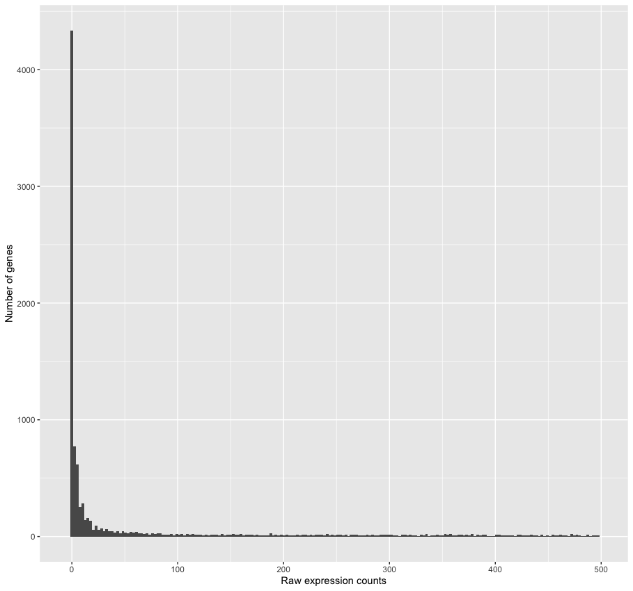
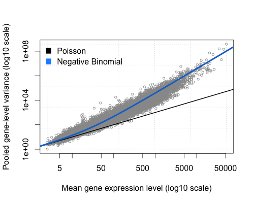
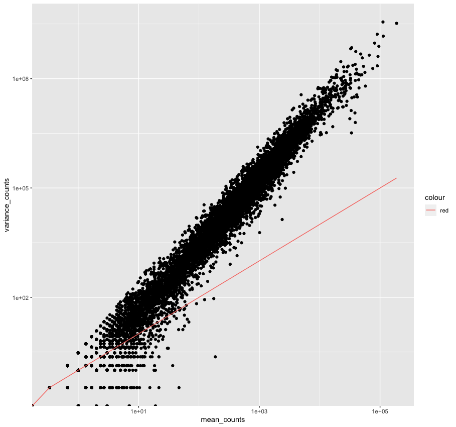
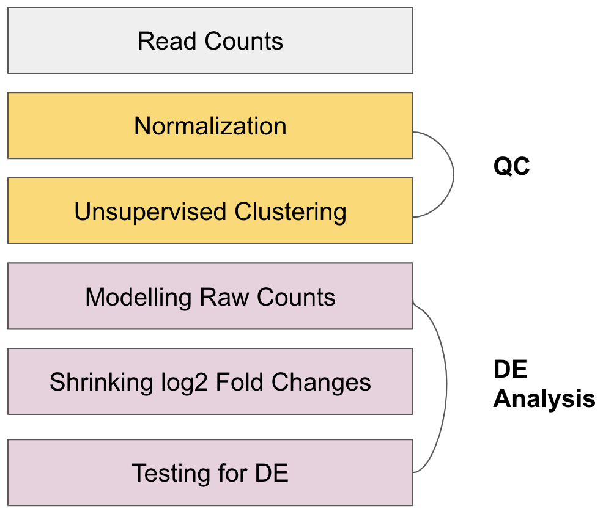
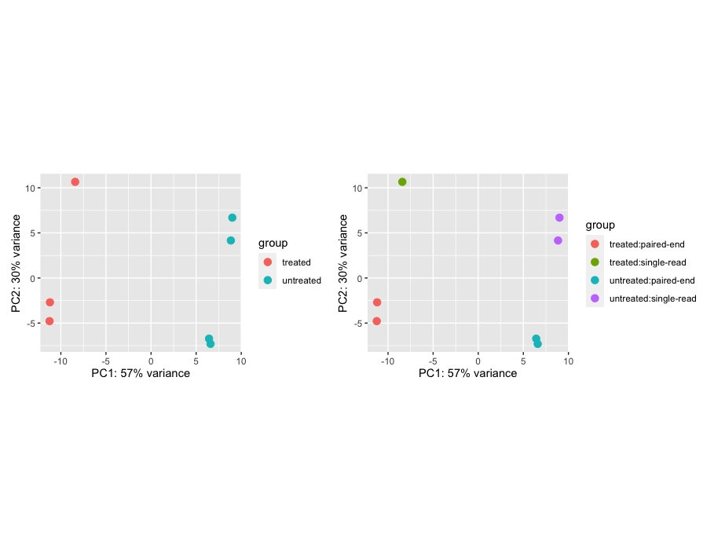
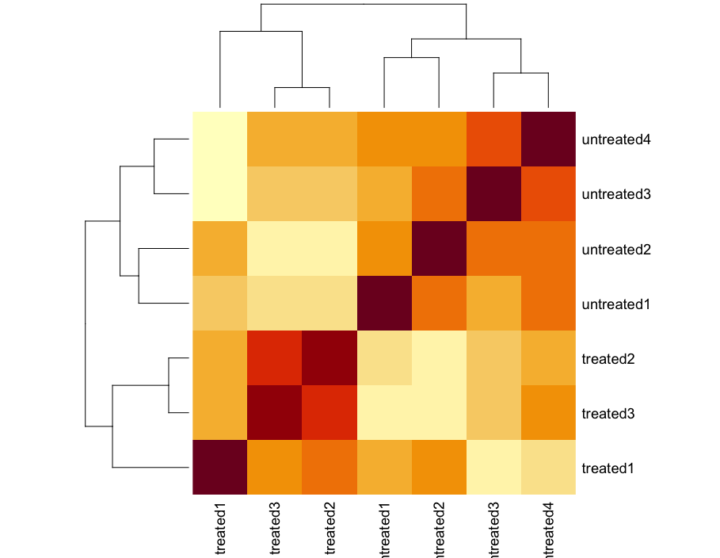
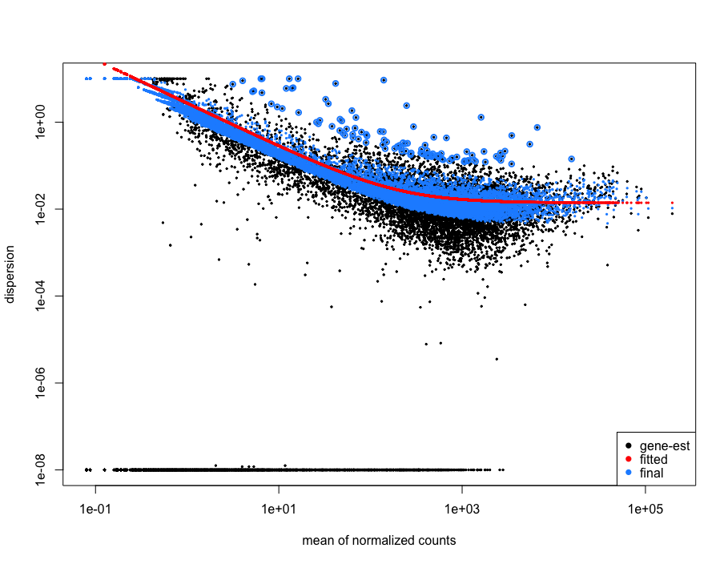

# Differential gene expression (DGE) analysis tutorial for GWSTA - Spring 2020
RNA-seq experiements are used to perform differential expression testing and identify which genes are expressed at different levels between conditions. These genes can offer biological insight into the processes affected by the condition of interest. 



#### Figure: Currently, the most popular bioinformatics workflow for DGE analysis.

### In this tutorial, we will go through gene-level RNA-seq differential expression workflow using DESeq2. 

The flow will be:
1. the count matrix
2. data analysis for quality control
3. the relationship between samples
4. perform differential expression analysis
5. visually explore the results
6. downstream functional analysis

In the before-class homework, i assume that, we all have loaded the `pasilla` data into R and performed DGE analysis. Now, lets start from there.

# An overview

What is a count matrix ? The count matrix represents the number of reads that originated from a particular gene. If the number of counts is high, more reads are associated with that gene, and we assume that there is a high level of expression of that gene in the sample.

`````r
head(cts, n = 3)
`````



With differential expression analysis, we are looking for genes that change in expression between two groups, defined in the metadata and in this case:

`````r
coldata

           condition        type
treated1     treated single-read
treated2     treated  paired-end
treated3     treated  paired-end
untreated1 untreated single-read
untreated2 untreated single-read
untreated3 untreated  paired-end
untreated4 untreated  paired-end
`````

* treated vs. untreated

### Why do not we use the fold changes of gene counts and bother doing DGE tests? Because we would lose too much information.

`````r
l2 = log2(cts)
l2 = l2[is.finite(rowSums(l2)),]
heatmap(l2[1:100,], Colv = NA, Rowv = NA)
`````



Genes that vary in expression level between samples is a consequence of not only the experimental variables of interest but also due to external origin. The aim of DE analysis is to determine the role of these effects. So that, we need to take into account the variation in the data when determining whether genes are differentially expressed.


With DE analysis, we can determine whether the differences in counts between groups is significant given the amount of variation observed within groups for each gene. To test for significance, we need a statistical model that accurately does the normalization and variance modeling in terms of replicates.

## RNA-seq count distribution

We need to determine for appropriate statistical model, accordingly, we plot the the distribution of counts for one of our samples.

`````r
library(ggplot2)

ggplot(data.table(cts)) +
    geom_histogram(aes(x = treated1), stat = "bin", bins = 200) + 
    xlim(-5, 500)  +
    xlab("Raw expression counts") +
    ylab("Number of genes")

`````


We can see some common features of RNA-seq count data, showing a low number of counts linked with a large proportion of genes, and a long right tail due to the lack of any upper limit for expression.

Modeling count data

* Count data is modeled using the binomial distribution. Yet, not all count data can be fit with the binomial distribution. The binomial is based on discrete events and used in situations when you have a certain number of cases.

### Poisson distribution VS Binomial distribution



### Choose between 
* mean == variance

OR
* mean < variance

Lets check out our data to see which model will fit. 
`````r
### cts[, 1:3] presents the treated samples. Check the coldata


mean_counts <- apply(cts[, 1:3], 1, mean)
variance_counts <- apply(cts[, 1:3], 1, var)
df <- data.frame(mean_counts, variance_counts)

ggplot(df) +
        geom_point(aes(x=mean_counts, y=variance_counts)) + 
        geom_line(aes(x=mean_counts, y=mean_counts, color="red")) +
        scale_y_log10() +
        scale_x_log10()
`````


# Differential expression analysis workflow



# The theory of count normalization

The first step in the DE analysis workflow is count normalization, which is necessary to make accurate comparisons of gene expression between samples.

Normalization is the process of scaling raw count values to account for the "uninteresting" factors. In this way the expression levels are more comparable between and/or within samples.

Factors include:

1. Gene length
2. RNA composition
3. Sequencing depth

Why do not we use TPM in normalization with DE analysis?

TPM (transcripts per kilobase million) is counts per length of transcript (kb) per million reads mapped. It normalizes for sequencing depth and gene length. It is the best method with gene count comparisons within a sample or between samples of the same sample group but NOT for DE analysis.

On the other hand, DESeq2's median of ratios is the counts divided by sample-specific size factors determined by median ratio of gene counts relative to geometric mean per gene. It normalizes for sequencing depth and RNA composition. It is recommended to be used with gene count comparisons between samples and for DE analysis; NOT for within sample comparisons.

### The steps of median of ratios method

**Step 1: Create a pseudo-reference sample (row-wise geometric mean)**

| Gene Name | Sample1 | Sample2 | Pseudo-reference sample   |   |
|-----------|---------|---------|---------------------------|---|
| geneA     | 1489    | 906     | sqrt(1489 * 906) = **1161.5** |   |
| geneB     | 22      | 13      | sqrt(22 * 13) = **17.7**      |   |

**Step 2: Calculate ratio of each sample to the reference**
| gene | sample1 | sample2 | Pseudo-reference sample  | ratio of sample1/ref | ratio of sample2/ref |
| ----- |:-----:|:-----:|:-----:| :-----: | :-----: |
| geneA | 1489 | 906 | 1161.5 | 1489/1161.5 = **1.28** | 906/1161.5 = **0.78** |
| geneB | 22 | 13 | 17.7 | 22/17.7 = **1.24** | 13/17.7 = **0.73** |
| ... | ... | ... | ... |

**Step 3: Calculate the normalization factor for each sample (size factor)**
````r
normalization_factor_sample1 <- median(c(1.28, 1.24, ...))

normalization_factor_sample2 <- median(c(0.78, 0.73, ...))
````

**Step 4: Calculate the normalized count values using the normalization factor**

Sample1 median ratio = 1.26

Sample2 median ratio = 0.755

**Raw Counts**

| gene | sample1 | sample2 |  
| ----- |:-----:|:-----:|
| geneA | 1489 | 906 | 
| geneB | 22 | 13 | 
| ... | ... | ... | 

**Normalized Counts**

| gene | sample1 | sample2 |
| ----- |:-----:|:-----:|
| geneA | 1489 / 1.26 = **1181.746** | 906 / 0.755 = **1200** | 
| geneB | 22 / 1.26 = **17.46032** | 13 / 0.755 = **17.21854** | 
| ... | ... | ... | 

## Count normalization of `pasilla` dataset using DESeq2

In the homework, we have imported the `pasilla` dataset and created our `DESeqDataSet` object. 

To perform the median of ratios method of normalization, DESeq2 has a single estimateSizeFactors() function that will generate size factors for us. We will use the function in the example below, but in a typical RNA-seq analysis this step is automatically performed by the DESeq() function, which we will see later.


```r
dds <- estimateSizeFactors(dds)
sizeFactors(dds)
```

Now, to retrieve the normalized counts matrix from `dds`, we use the `counts()` function and add the argument `normalized=TRUE`.

```r
normalized_counts <- counts(dds, normalized=TRUE)
```

# Sample-level QC

To explore the similarity of our samples:
1. Principal Component Analysis (PCA)
2. Hierarchical clustering methods

Sample-level QC shows how well the replicates cluster together and whether the experimental condition represents the major source of variation in the data. Performing sample-level QC can also identify any sample outliers, which may need to be explored further to determine whether they need to be removed prior to DE analysis.

Using unsupervised clustering methods require log2-transformation of the normalized counts improves the distances/clustering for visualization. DESeq2 uses a regularized log transform (rlog) of the normalized counts for sample-level QC as it moderates the variance across the mean, improving the clustering.

## Principal components analysis (PCA)

Please see [StatQuest's video](https://www.youtube.com/watch?v=FgakZw6K1QQ) for detailed information on PCA.

### Transform normalized counts using the rlog transformation

**To improve the distances/clustering for the PCA and heirarchical clustering visualization methods**, we need to moderate the variance across the mean by applying the rlog transformation to the normalized counts. 

````r
rld <- rlog(dds, blind=T)
##OR
vsd <- vst(dds, blind = T)
````
The vst() function is faster and performs a similar transformation to use with plotPCA(). It's typically just a few seconds with vst() due to optimizations and the nature of the transformation.

Now we can plot our PCA.

````r
### Plot PCA by labeling the condition, checkout the coldata again
plotPCA(vsd, intgroup="condition")
### AND PLOT by labeling the condition and type
plotPCA(vsd, intgroup=c("condition","type"))

### What feature have we seen related to the data after labelling for both columns in coldata?
````


## Hierarchical Clustering
We will be using `heatmap()` function in R. We will be aiding matrix/dataframe of numeric values as input, so we retrieve that information from the `vsd` object.

````r
### Extract the variance stabilized matrix from the object
vsd_mat <- assay(vsd)
### Compute pairwise correlation values
vsd_cor <- cor(vsd_mat)    ## cor() is a base R function

head(vsd_cor)

### Plot heatmap
heatmap(vsd_cor)
````


In general, we have seen the clustering that is appropriate to our metadata as in `coldata`.


# Differential expression analysis with DESeq2

The final step in the differential expression analysis workflow is fitting the raw counts to the NB model and performing the statistical test for differentially expressed genes. In this step we essentially want to determine whether the mean expression levels of different sample groups are significantly different.

When the `DESeq()` runs, the verbose output shows below:

````r
DESeq(dds)

estimating size factors
estimating dispersions
gene-wise dispersion estimates
mean-dispersion relationship
final dispersion estimates
fitting model and testing

````

* In general, DESeq2 will model the raw counts, with size factors for differences in library depth. 
* Then, it will estimate the gene-wise dispersions and shrink these estimates to generate more accurate estimates of dispersion to model the counts.
* Finally, DESeq2 will fit the negative binomial model and perform hypothesis testing using the Wald test or Likelihood Ratio Test.

## Performing DESeq2 Workflow

## Design Formula

Firstly, we need to have our design formula deriving from our hypothesis. In `pasilla` case, treatment of RNAi should significantly reduce the expression of the pasilla gene. 

The design formula should have all of the factors in our `coldata` that account for major sources of variation. The last factor entered in the formula should be the condition of interest. Our condition of interest is the column named `condition` which consists of factors called `treated` or `untreated`.

````r
coldata

           condition        type
treated1     treated single-read
treated2     treated  paired-end
treated3     treated  paired-end
untreated1 untreated single-read
untreated2 untreated single-read
untreated3 untreated  paired-end
untreated4 untreated  paired-end

design <- ~ condition
### In the homework, we have already created our dds object with this design

dds <- DESeq(dds)

contrast <- c("condition","treated","untreated")

### FBgn0261552 is the stable gene id for pasilla gene.
results(dds, contrast = contrast, alpha = 0.05)["FBgn0261552",]
````

## Complex Designs

In the PCA plots that we have generated, we have seen that library prep. methods of single-end reads and paired-end reads have clusted differently regardless of condition. This may introduce a negative effect while fitting the linear model. Accordingly, we need to create a more complex formula to see the "the difference of differences". We want to see the effect of library preperation method, called `type`, on the `condition`.

Remember: The last factor you type in the formula will be the major source of variation, in other words, what you're interested in. This is the way, how linear models interpret the design formulas.

````r
### We make a new formula to explore the effect of type on condition, and create a new DEseqDataSet for the new design

dds2 <- DESeqDataSetFromMatrix(
    countData = cts,
    colData = coldata,
    design = ~ condition + type:condition)

dds2 <- DESeq(dds2)

contrast <- c("condition","treated","untreated")
results(dds2, contrast = contrast, alpha = 0.05)["FBgn0261552",]

### Please, compare the log2 fold changes of the gene between different designs.
````
Now we follow the `DESeq()` workflow.

**Step 1: estimating size factors**

We have talked about it in the normalization section. Lets check the size factors and the sequencing depth of the normalized counts with the following code.

````r
sizeFactors(dds)
colSums(counts(dds, normalized=T))
````
**Step 2: estimating gene-wise dispersion**

Dispersion is a measure of spread or variability in the data. The DESeq2 dispersion estimates are inversely related to the mean and directly related to variance. Based on this relationship, the dispersion is higher for small mean counts and lower for large mean counts.  With only a few replicates per group, the estimates of variation for each gene are often unreliable (due to the large differences in dispersion for genes with similar means).

To address this problem, DESeq2 shares information across genes to generate more accurate estimates of variation based on the mean expression level of the gene using a method called 'shrinkage'. DESeq2 assumes that genes with similar expression levels have similar dispersion.

To model the dispersion based on expression level (mean counts of replicates), the dispersion for each gene is estimated using maximum likelihood estimation. In other words, given the count values of the replicates, the most likely estimate of dispersion is calculated.

**Step 3: fit curve to gene-wise dispersion estimates**

The idea behind fitting a curve to the data is that different genes will have different scales of biological variability, but, over all genes, there will be a distribution of reasonable estimates of dispersion.

````r
plotDispEsts(dds)
````



This curve is displayed as a red line in the figure below, which plots the estimate for the expected dispersion value for genes of a given expression strength. Each black dot is a gene with an associated mean expression level and maximum likelihood estimation (MLE) of the dispersion.

**Step 4: shrink gene-wise dispersion estimates**

This shrinkage method is particularly important to reduce false positives in the differential expression analysis. Dispersion estimates that are slightly above the curve are also shrunk toward the curve for better dispersion estimation; however, genes with extremely high dispersion values are not. This is due to the likelihood that the gene does not follow the modeling assumptions and has higher variability than others for biological or technical reasons.

We expect the data to generally scatter around the curve, with the dispersion decreasing with increasing mean expression levels.

A bad dispersion might be :


**Summary:**


Part I

1. Calculate the maximum-likelihood estimate (MLE) of dispersion for each gene in the dataset (black dots).

2. Model the MLEs (red curve)

3. From the model curve fit in 2, predict a value for each gene

Part II

1. Fit an empirical Bayes regression model to the MLEs and use the predicted values from the model curve fit in Step I, Part 3 (above) as the mean priors for each gene in the model. In empirical Bayesian statistics, by supplying 'priors' to the model, one is saying that these priors are the measured / empirical values and that we want to 'shrink' our current data to match the distribution of these priors.

2. Predict values from this model (blue dots) - these are the final dispersion estimates. What happens is that genes with lower counts have higher dispersion and are 'shrunk' more toward the red line than higher counts, which have lower dispersion.*”


# Generalized Linear Model

# Shrunken log2 foldchanges

# Wald test

# FDR/Benjamini-Hochberg

# Extracting significant differentially expressed genes

# Plotting the results


**Credits:**

**In this tutorial, the teaching flow of Differential gene expression workshop by the team at the Harvard Chan Bioinformatics Core (HBC) has been followed, compressed and adapted to `pasilla` dataset. Please see this [GitHub repo](https://github.com/hbctraining/DGE_workshop).**
