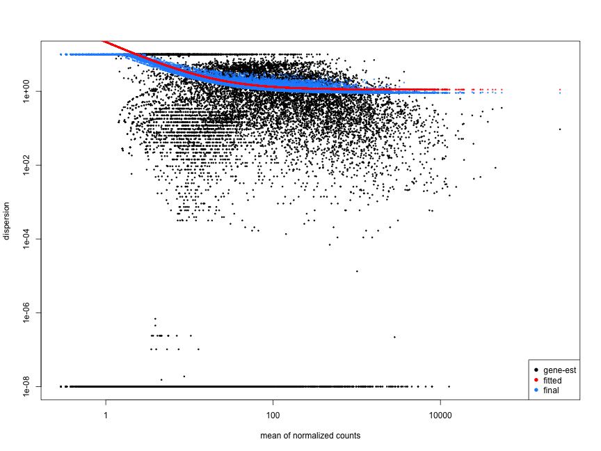

# Differential gene expression (DGE) analysis tutorial for GWSTA - Spring 2020
RNA-seq experiements are used to perform differential expression testing and identify which genes are expressed at different levels between conditions. These genes can offer biological insight into the processes affected by the condition of interest. 


#### Figure: Currently, the most popular bioinformatics workflow for DGE analysis.

### In this tutorial, we will go through gene-level RNA-seq differential expression workflow using DESeq2. 

The flow will be:
1. the count matrix
2. data analysis for quality control
3. the relationship between samples
4. perform differential expression analysis
5. visually explore the results
6. downstream functional analysis

In the before-class homework, i assume that, we all have loaded the `pasilla` data into R and performed DGE analysis. Now, lets start from there.

# An overview

What is a count matrix ? The count matrix represents the number of reads that originated from a particular gene. If the number of counts is high, more reads are associated with that gene, and we assume that there is a high level of expression of that gene in the sample.

`````r
head(cts, n = 3)
`````


With differential expression analysis, we are looking for genes that change in expression between two groups, defined in the metadata and in this case:

`````r
coldata

           condition        type
treated1     treated single-read
treated2     treated  paired-end
treated3     treated  paired-end
untreated1 untreated single-read
untreated2 untreated single-read
untreated3 untreated  paired-end
untreated4 untreated  paired-end
`````

* treated vs. untreated

### Why do not we use the fold changes of gene counts and bother doing DGE tests? Because we would lose too much information.

`````r
l2 = log2(cts)
l2 = l2[is.finite(rowSums(l2)),]
heatmap(l2[1:1000,])
`````


Genes that vary in expression level between samples is a consequence of not only the experimental variables of interest but also due to external origin. The aim of DE analysis is to determine the role of these effects. So that, we need to take into account the variation in the data when determining whether genes are differentially expressed.


With DE analysis, we can determine whether the differences in counts between groups is significant given the amount of variation observed within groups for each gene. To test for significance, we need a statistical model that accurately does the normalization and variance modeling in terms of replicates.

## RNA-seq count distribution

We need to determine for appropriate statistical model, accordingly, we plot the the distribution of counts for one of our samples.

`````r
library(ggplot2)

ggplot(data.table(cts)) +
    geom_histogram(aes(x = treated1), stat = "bin", bins = 200) + 
    xlim(-5, 500)  +
    xlab("Raw expression counts") +
    ylab("Number of genes")

`````


We can see some common features of RNA-seq count data, showing a low number of counts linked with a large proportion of genes, and a long right tail due to the lack of any upper limit for expression.

Modeling count data

* Count data is modeled using the binomial distribution. Yet, not all count data can be fit with the binomial distribution. The binomial is based on discrete events and used in situations when you have a certain number of cases.

### Poisson distribution VS Binomial distribution

First of all, since reads are count based, they can't be normally distributed (you can't have -3 counts, or 12.2 counts). 

Two distributions for count based data are 
1. poisson (which presumes the variance and mean [ie expression in our case] are equal) or
2. Negative binomial (which does not).

This is especially a problem when the number of biological replicates are low because it is hard to accurately model variance of count based data if you are looking at only that gene and making the assumptions of normally distributed continuous data (ie a t-test). A good estimate of variance for each gene is essential to determine whether the changes are due to chance.

DESeq2 allow for the **global variance** of a gene to be estimated for a certain read density. This generates a more accurate estimate of the variance than looking at each individual gene's (potentially small n) distribution. Is this dispersion ?

This variance parameter is then used to model the NB distribution for each gene and therefore to more accurately estimate the error term. As the number of samples increases, the local (gene-specific) variance can be better estimated.


### Choose between 
* mean == variance

OR
* mean < variance

Lets check out our data to see which model will fit. 
`````r
### cts[, 1:3] presents the treated samples. Check the coldata


mean_counts <- apply(cts[, 1:3], 1, mean)
variance_counts <- apply(cts[, 1:3], 1, var)
df <- data.frame(mean_counts, variance_counts)

ggplot(df) +
        geom_point(aes(x=mean_counts, y=variance_counts)) + 
        geom_line(aes(x=mean_counts, y=mean_counts, color="red")) +
        scale_y_log10() +
        scale_x_log10()
`````


# Differential expression analysis workflow


# The theory of count normalization

The first step in the DE analysis workflow is count normalization, which is necessary to make accurate comparisons of gene expression between samples.

Normalization is the process of scaling raw count values to account for the "uninteresting" factors. In this way the expression levels are more comparable between and/or within samples.

Factors include:

1. Gene length
2. RNA composition
3. Sequencing depth

Why do not we use TPM in normalization with DE analysis?

TPM (transcripts per kilobase million) is counts per length of transcript (kb) per million reads mapped. It normalizes for sequencing depth and gene length. It is the best method with gene count comparisons within a sample or between samples of the same sample group but NOT for DE analysis.

On the other hand, DESeq2's median of ratios is the counts divided by sample-specific size factors determined by median ratio of gene counts relative to geometric mean per gene. It normalizes for sequencing depth and RNA composition. It is recommended to be used with gene count comparisons between samples and for DE analysis; NOT for within sample comparisons.

### The steps of median of ratios method

**Step 1: Create a pseudo-reference sample (row-wise geometric mean)**

| Gene Name | Sample1 | Sample2 | Pseudo-reference sample   |   |
|-----------|---------|---------|---------------------------|---|
| geneA     | 1489    | 906     | sqrt(1489 * 906) = **1161.5** |   |
| geneB     | 22      | 13      | sqrt(22 * 13) = **17.7**      |   |

**Step 2: Calculate ratio of each sample to the reference**
| gene | sample1 | sample2 | Pseudo-reference sample  | ratio of sample1/ref | ratio of sample2/ref |
| ----- |:-----:|:-----:|:-----:| :-----: | :-----: |
| geneA | 1489 | 906 | 1161.5 | 1489/1161.5 = **1.28** | 906/1161.5 = **0.78** |
| geneB | 22 | 13 | 17.7 | 22/17.7 = **1.24** | 13/17.7 = **0.73** |
| ... | ... | ... | ... |

**Step 3: Calculate the normalization factor for each sample (size factor)**
````r
normalization_factor_sample1 <- median(c(1.28, 1.24, ...))

normalization_factor_sample2 <- median(c(0.78, 0.73, ...))
````

**Step 4: Calculate the normalized count values using the normalization factor**

Sample1 median ratio = 1.26

Sample2 median ratio = 0.755

**Raw Counts**

| gene | sample1 | sample2 |  
| ----- |:-----:|:-----:|
| geneA | 1489 | 906 | 
| geneB | 22 | 13 | 
| ... | ... | ... | 

**Normalized Counts**

| gene | sample1 | sample2 |
| ----- |:-----:|:-----:|
| geneA | 1489 / 1.26 = **1181.746** | 906 / 0.755 = **1200** | 
| geneB | 22 / 1.26 = **17.46032** | 13 / 0.755 = **17.21854** | 
| ... | ... | ... | 

## Count normalization of `pasilla` dataset using DESeq2

In the homework, we have imported the `pasilla` dataset and created our `DESeqDataSet` object. 

To perform the median of ratios method of normalization, DESeq2 has a single estimateSizeFactors() function that will generate size factors for us. We will use the function in the example below, but in a typical RNA-seq analysis this step is automatically performed by the DESeq() function, which we will see later.


```r
dds <- estimateSizeFactors(dds)
sizeFactors(dds)
```

Now, to retrieve the normalized counts matrix from `dds`, we use the `counts()` function and add the argument `normalized=TRUE`.

```r
normalized_counts <- counts(dds, normalized=TRUE)
```

# Sample-level QC

To explore the similarity of our samples:
1. Principal Component Analysis (PCA)
2. Hierarchical clustering methods

Sample-level QC shows how well the replicates cluster together and whether the experimental condition represents the major source of variation in the data. Performing sample-level QC can also identify any sample outliers, which may need to be explored further to determine whether they need to be removed prior to DE analysis.

Using unsupervised clustering methods require log2-transformation of the normalized counts improves the distances/clustering for visualization. DESeq2 uses a regularized log transform (rlog) of the normalized counts for sample-level QC as it moderates the variance across the mean, improving the clustering.

## Principal components analysis (PCA)

Please see [StatQuest's video](https://www.youtube.com/watch?v=FgakZw6K1QQ) for detailed information on PCA.

### Transform normalized counts using the rlog transformation

**To improve the distances/clustering for the PCA and heirarchical clustering visualization methods**, we need to moderate the variance across the mean by applying the rlog transformation to the normalized counts. 

````r
rld <- rlog(dds, blind=T)
##OR
vsd <- vst(dds, blind = T)
````
The vst() function is faster and performs a similar transformation to use with plotPCA(). It's typically just a few seconds with vst() due to optimizations and the nature of the transformation.

Now we can plot our PCA.

````r
### Plot PCA by labeling the condition, checkout the coldata again
plotPCA(vsd, intgroup="condition")
### AND PLOT by labeling the condition and type
plotPCA(vsd, intgroup=c("condition","type"))

### What feature have we seen related to the data after labelling for both columns in coldata?
````


## Hierarchical Clustering
We will be using `heatmap()` function in R. We will be aiding matrix/dataframe of numeric values as input, so we retrieve that information from the `vsd` object.

````r
### Extract the variance stabilized matrix from the object
vsd_mat <- assay(vsd)
### Compute pairwise correlation values
vsd_cor <- cor(vsd_mat)    ## cor() is a base R function

head(vsd_cor)

### Plot heatmap
heatmap(vsd_cor)
````


In general, we have seen the clustering that is appropriate to our metadata as in `coldata`.


# Differential expression analysis with DESeq2

The final step in the differential expression analysis workflow is fitting the raw counts to the NB model and performing the statistical test for differentially expressed genes. In this step we essentially want to determine whether the mean expression levels of different sample groups are significantly different.

When the `DESeq()` runs, the verbose output shows below:

````r
DESeq(dds)

estimating size factors
estimating dispersions
gene-wise dispersion estimates
mean-dispersion relationship
final dispersion estimates
fitting model and testing

````

* In general, DESeq2 will model the raw counts, with size factors for differences in library depth. 
* Then, it will estimate the gene-wise dispersions and shrink these estimates to generate more accurate estimates of dispersion to model the counts.
* Finally, DESeq2 will fit the negative binomial model and perform hypothesis testing using the Wald test or Likelihood Ratio Test.

## Performing DESeq2 Workflow


## Design Formula

Firstly, we need to have our design formula deriving from our hypothesis. In `pasilla` case, treatment of RNAi should significantly reduce the expression of the pasilla gene. 

The design formula should have all of the factors in our `coldata` that account for major sources of variation. The last factor entered in the formula should be the condition of interest. Our condition of interest is the column named `condition` which consists of factors called `treated` or `untreated`.

````r
coldata

           condition        type
treated1     treated single-read
treated2     treated  paired-end
treated3     treated  paired-end
untreated1 untreated single-read
untreated2 untreated single-read
untreated3 untreated  paired-end
untreated4 untreated  paired-end

design <- ~ condition
### In the homework, we have already created our dds object with this design

dds <- DESeq(dds)

contrast <- c("condition","treated","untreated")

### FBgn0261552 is the stable gene id for pasilla gene.
results(dds, contrast = contrast, alpha = 0.05)["FBgn0261552",]
````

## Complex Designs

In the PCA plots that we have generated, we have seen that library prep. methods of single-end reads and paired-end reads have clusted differently regardless of condition. This may introduce a negative effect while fitting the linear model. Accordingly, we need to create a more complex formula to see the "the difference of differences". We want to see the effect of library preperation method, called `type`, on the `condition`.

Remember: The last factor you type in the formula will be the major source of variation, in other words, what you're interested in. This is the way, how linear models interpret the design formulas.

````r
### We make a new formula to explore the effect of type on condition, and create a new DEseqDataSet for the new design

dds2 <- DESeqDataSetFromMatrix(
    countData = cts,
    colData = coldata,
    design = ~ condition + type:condition)

dds2 <- DESeq(dds2)

contrast <- c("condition","treated","untreated")
results(dds2, contrast = contrast, alpha = 0.05)["FBgn0261552",]

### Please, compare the log2 fold changes of the gene between different designs.
````
## Now we follow the `DESeq()` workflow.

**Step 1: estimating size factors**

We have talked about it in the normalization section. Lets check the size factors and the sequencing depth of the normalized counts with the following code.

````r
sizeFactors(dds)
colSums(counts(dds, normalized=T))
````
**Step 2: estimating gene-wise dispersion**

Dispersion is a measure of spread or variability in the data. The DESeq2 dispersion estimates are inversely related to the mean and directly related to variance. Based on this relationship, the dispersion is higher for small mean counts and lower for large mean counts and with only a few replicates per group, the estimates of variation for each gene are often unreliable (due to the large differences in dispersion for genes with similar means). 

To address this problem, DESeq2 shares information across genes to generate more accurate estimates of variation based on the mean expression level of the gene using a method called 'shrinkage'. DESeq2 assumes that genes with similar expression levels have similar dispersion.

To model the dispersion based on expression level (mean counts of replicates), the dispersion for each gene is estimated using maximum likelihood estimation. In other words, given the count values of the replicates, the most likely estimate of dispersion is calculated. Simply, 0.01 dispersion means 10% variation around the mean expected across biological replicates.

**Step 3: fit curve to gene-wise dispersion estimates**

To accurately model counts, we need to generate accurate estimates of within-group variation (variation between replicates of the same sample group) for each gene. With only a few (3-6) replicates per group, the estimates of variation for each gene are often unreliable (due to the large differences in dispersion for genes with similar means).


The idea behind fitting a curve to the data is that different genes will have different scales of biological variability, but, over all genes, there will be a distribution of reasonable estimates of dispersion.


````r
plotDispEsts(dds)
````


This curve is displayed as a red line in the figure below, which plots the estimate for the expected dispersion value for genes of a given expression strength. Each black dot is a gene with an associated mean expression level and maximum likelihood estimation (MLE) of the dispersion.

**Step 4: shrink gene-wise dispersion estimates**

This shrinkage method is particularly important to reduce false positives in the differential expression analysis. Dispersion estimates that are slightly above the curve are also shrunk toward the curve for better dispersion estimation; however, genes with extremely high dispersion values are not. This is due to the likelihood that the gene does not follow the modeling assumptions and has higher variability than others for biological or technical reasons.

We expect the data to generally scatter around the curve, with the dispersion decreasing with increasing mean expression levels.

**A bad dispersion might be:**

**contamination (mitochondrial, etc.) ?**

**or outlier samples ?**



**Summary:**


Problem: Sample sizes tend to be smaller (experimental designs with as little as two or three replicates are common and reasonable), resulting in highly variable dispersion estimates for each gene.

Solution: DESeq2 assumes that genes of similar average expression strength have similar dispersion. 

1. Treat each gene separately and estimate gene-wise dispersion estimates (using maximum likelihood), which rely only on the data of each individual gene (black dots).
2. Next, determine the location parameter of the distribution of these estimates; to allow for dependence on average expression strength, fit a smooth curve, as shown by the red line.
3. Shrink the gene-wise dispersion estimates toward the values predicted by the curve to obtain final dispersion values (blue arrow heads).

Strength of shrinkage depends 
* on an estimate of how close true dispersion values tend to be to the fit 
* on the degrees of freedom: as the sample size increases, the shrinkage decreases in strength.


# Generalized Linear Model

The final step in the DESeq2 workflow is fitting the Negative Binomial model for each gene and performing differential expression testing.

The count data generated by RNA-seq exhibits overdispersion (variance > mean) and the statistical distribution used to model the counts needs to account for this overdispersion. DESeq2 uses a negative binomial distribution to model the RNA-seq counts.

In the simplest case of a comparison between two groups, such as treated and control samples, the design matrix elements indicate whether a sample j is treated or not, and the GLM fit returns coefficients indicating the overall expression strength of the gene and the log 2 fold change between treatment and control.

# Shrunken log2 foldchanges

Problem: A common difficulty in the analysis of RNA-seq data is the strong variance of LFC estimates for genes with low read count. Weakly expressed genes seem to show much stronger differences than strongly expressed genes. Variance of LFCs depending on mean count complicates downstream analysis and data interpretation.

Solution: Similar to dispersion shrinkage. Shrinking LFC estimates toward zero in a manner such that shrinkage is stronger when the available information for a gene is low.

Information for a gene ? 
*  Low counts
* High dispersion values

An example from DESeq2 paper:

* The green gene and purple gene have the same mean values for the two sample groups
* Green gene has little variation while the purple gene has high levels of variation
* For green gene, unshrunken LFC estimate is very similar to the shrunken LFC
* Shrunken LFC of purple gene is quite different due to the high dispersion

Meaning that:

Two genes can have similar normalized count values, but different degrees of LFC shrinkage will be applied.

# Wald test

The first step in hypothesis testing is to set up a null hypothesis for each gene. In our case is, the null hypothesis is that there is no differential expression across the two sample groups (LFC == 0).

With DESeq2, the Wald test is commonly used for hypothesis testing when comparing two groups. A Wald test statistic is computed along with a probability that a test statistic at least as extreme as the observed value were selected at random. This probability is called the p-value of the test. If the p-value is small we reject the null hypothesis and state that there is evidence against the null meaning that the gene is differentially expressed.

## Creating contrasts

To indicate to DESeq2 the two groups we want to compare, we can use contrasts. Contrasts are then provided to DESeq2 to perform differential expression testing using the Wald test. Contrasts can be provided to DESeq2 a couple of different ways:

1. Do nothing. Automatically DESeq2 will use the base factor level of the condition of interest as the base for statistical testing. The base level is chosen based on alphabetical order of the levels.

2. In the results() function you can specify the comparison of interest, and the levels to compare. The level given last is the base level for the comparison. The syntax is given below:

### **Lets compare treated vs untreated**

````r
### contrast syntax
### contrast <- c("condition", "level_to_compare", "base_level")

contrast = c("condition","treated","untreated")
results(dds, contrast = contrast, alpha = 0.05)


````

## Independent Filtering

You will notice that some of the adjusted p-values (padj) are NA. We know that there is no need to pre-filter the genes as DESeq2 will do this through a process it calls ‘independent filtering’. The genes with NA are the ones DESeq2 has filtered out.

From DESeq2 manual: “The results function of the DESeq2 package performs independent filtering by default using the mean of normalized counts as a filter statistic. A threshold on the filter statistic is found which optimizes the number of adjusted p values lower than a [specified] significance level”.

The default significance level for independent filtering is 0.1, however, you should set this to the FDR cut off you are planning to use. We will use 0.05 - this was the purpose of the alpha argument in the previous command.

Basically, by removing the weakly-expressed genes from the input to the FDR procedure, we can find more genes to be significant among those
which we keep, and so improved the power of our FDR test.

# FDR/Benjamini-Hochberg

If we used the p-value directly from the Wald test with a significance cut-off of p < 0.05, that means there is a 5% chance it is a false positives. Each p-value is the result of a single test (single gene). The more genes we test, the more we inflate the false positive rate. This is the multiple testing problem. For example, if we test 20,000 genes for differential expression, at p < 0.05 we would expect to find 1,000 genes by chance. If we found 3000 genes to be differentially expressed total, roughly one third of our genes are false positives. We would not want to match "significant" genes and identify which ones are true positives.

FDR: Benjamini and Hochberg (BH, 1995) defined the concept of FDR and created an algorithm to control the expected FDR below a specified level given a list of independent p-values. 

In DESeq2, the p-values by the Wald test are corrected for multiple testing using the Benjamini and Hochberg method by default. The p-adjusted values should be used to determine significant genes. The significant genes can be output for visualization or functional analysis. 

# Extracting significant differentially expressed genes

# Plotting the results

## Building the results table

````r
contrast = c("condition","treated","untreated")
res_tableOE_unshrunken <- results(dds, contrast=contrast, alpha = 0.05)

res_tableOE <- lfcShrink(dds, contrast=contrast, res=res_tableOE_unshrunken)
````

## Summary of results

````r
summary(res_tableOE)
````

## MA Plot

The MA plot shows the mean of the normalized counts versus the log2 foldchanges for all genes tested. The genes that are significantly DE are colored to be easily identified. This is also a great way to illustrate the effect of LFC shrinkage. The DESeq2 package offers a simple function to generate an MA plot.

````r
plotMA(res_tableOE_unshrunken, ylim=c(-2,2))
### vs
plotMA(res_tableOE, ylim=c(-2,2))
````

## Plotting counts
````r
### FBgn0261552 is the stable gene id for pasilla gene.
plotCounts(dds, gene="FBgn0261552", intgroup="condition") 
````

## Using ggplot2 to plot expression of a single gene
````r
# Save plotcounts to a data frame object
d <- plotCounts(dds, gene="FBgn0261552", intgroup="condition", returnData=TRUE)

### check d
d

ggplot(d, aes(x = condition, y = count, color = condition)) + 
    geom_label(aes(label = rownames(d))) +
    theme_bw() +
    ggtitle("Pasilla") +
    theme(plot.title = element_text(hjust = 0.5))
````

## Extracting significant differentially expressed genes
````r
### Set thresholds
padj.cutoff <- 0.05
lfc.cutoff <- 0.58

res_tableOE_df <- data.frame(res_tableOE)
res_tableOE_df$ensembl_gene_id <- rownames(res_tableOE_df)
rownames(res_tableOE_df) <- NULL


sig <- subset(res_tableOE_df, abs(log2FoldChange) >= lfc.cutoff & padj <= padj.cutoff)

sig
````
## Volcano Plots
A commonly used plot for global view of genes is a volcano plot; in which you have the log transformed adjusted p-values plotted on the y-axis and log2 fold change values on the x-axis.


````r

FUN <- function(x){
    x$oe = ifelse(abs(x$log2FoldChange) >= 0.58 & x$padj <= 0.05, TRUE, FALSE)
    return(x)
}

column <- by(res_tableOE_df, INDICES = res_tableOE_df$gene, FUN = FUN)
res_tableOE_volcano <- do.call(rbind, column)
### Dont wory for the several lines of code above, it just adds a new column to the res_tableOE_df, for annotating if the gene is significant or not. In yes or no manner. So that, we can color differently in our volcano plot. Another option can be dplyr::mutate()

# library("dplyr")
# res_tableOE_volcano <- res_tableOE_df %>% 
#                  mutate(oe = padj < 0.05 & abs(log2FoldChange) >= 0.58)

ggplot(res_tableOE_volcano) +
        geom_point(aes(x = log2FoldChange, y = -log10(padj), colour = oe)) +
        ggtitle("Pasilla Dataset") +
        xlab("log2 fold change") + 
        ylab("-log10 adjusted p-value") +
        theme(legend.position = "none",
              plot.title = element_text(size = rel(1.5), hjust = 0.5),
              axis.title = element_text(size = rel(1.25)))  

````
# Functional Analysis

If you would like to complete this section on your own, please download `biomaRt`, `org.Dm.eg.db` and `clusterProfiler` with `BiocManager` after the tutorial.

````r
library("biomaRt")

mart <- useMart("ENSEMBL_MART_ENSEMBL")
mart <- useDataset("dmelanogaster_gene_ensembl", mart)

ensLookup <- sig$ensembl_gene_id

annotLookup <- getBM(
  mart=mart,
  attributes=c("external_gene_name","gene_biotype", "ensembl_gene_id"),
  filter="ensembl_gene_id",
  values=ensLookup,
  uniqueRows=TRUE)

annotated_results <- merge(annotLookup,sig,by="ensembl_gene_id")

library("clusterProfiler")
library("org.Dm.eg.db")

ego <- enrichGO(gene = annotated_results$ensembl_gene_id,
                keyType = "ENSEMBL",
                OrgDb = org.Dm.eg.db, 
                ont = "BP", 
                pAdjustMethod = "BH", 
                qvalueCutoff = 0.05, 
                readable = TRUE)

##Visualize

dotplot(ego, showCategory=50)
emapplot(ego, showCategory = 50)


````

**Credits:**

**In this tutorial, the teaching flow of Differential gene expression workshop by the team at the Harvard Chan Bioinformatics Core (HBC) has been followed, compressed and adapted to `pasilla` dataset. Please see this [GitHub repo](https://github.com/hbctraining/DGE_workshop).**
